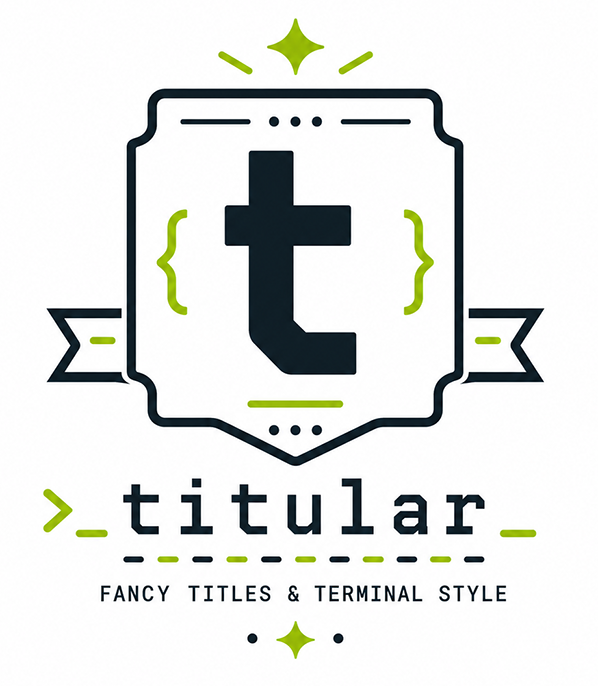

# Titular (WIP)

<div align="center">



</div>

A command-line tool to render configurable title lines in your terminal (ANSI styles, templates, optional syntax-highlighted preview).


## Highlights

- Title patterns driven by **[Tera](https://keats.github.io/tera/)** templates (`.tl` files: TOML metadata + a pattern string) and a **TOML** app config
- **ANSI** colors and padding controls via CLI flags (`-m`, `-f`, `-c`, `-w`, …)
- Optional **`display`** feature: embedded **Syntect** themes and richer preview for `titular templates …`
- Optional **`fetcher`** feature: **`titular templates add`** to install templates from a URL
- Optional **`bundler`** feature: **`titular templates export` / `import`** for `.tpz` (ZIP) bundles

## Installation

### From Source

```bash
git clone https://github.com/pnavais/titular.git
cd titular

cargo build --release
cargo install --path .
```

### From Cargo

```bash
cargo install titular
```

Default crates.io builds use the **`application`** feature set (`minimal` + **`fetcher`**). For themes, fancy preview, and `.tpz` bundles, install with **`full_application`** (see [Cargo features](#cargo-features)).

## Usage

Render a line with the default template and a message:

```bash
titular -m "Hello, world"
```

Pick a template and width (percent of terminal width):

```bash
titular -t basic -m "Status" -w 80
```

Interpret escapes in `-m` / `-f` like `echo -e`:

```bash
titular -e -m "Line one\nLine two"
```

With **`display`** enabled, set the syntax theme for theme-related palette helpers and preview:

```bash
titular -t ansible -m "Deploy" -T Monokai
titular templates list --themes
```

Manage templates:

```bash
titular templates list
titular templates list -o json
titular templates create mytpl
titular templates edit mytpl
titular templates show mytpl
titular templates remove mytpl
```

With **`fetcher`** (included in default **`application`**):

```bash
titular templates add 'https://example.com/path/template.tl'
titular templates add 'user/repo:/templates/foo.tl'   # GitHub-style shortcut
titular templates add <url> -f                       # overwrite existing
```

With **`bundler`** (**`full_application`**):

```bash
titular templates export -o ./backup.tpz
titular templates import ./backup.tpz
titular templates import ./bundle.tpz -f              # overwrite existing
```

## Templates (Tera)

The visible title line comes from a **template file** (`.tl`): TOML sections describe metadata and variables; the actual layout is a **[Tera](https://keats.github.io/tera/)** string in `[pattern].data`. Titular registers **custom filters and one function** on top of Tera’s usual syntax (`{{ }}`, ``, filters, and [built-ins](https://keats.github.io/tera/docs/#built-ins) supplied by the engine).

### Layout of a `.tl` file

| Section | Role |
| ------- | ---- |
| **`[details]`** | `name`, `version`, `author`, `url`, … |
| **`[vars]`** | Names you use inside the pattern (`f`, `c`, …). With **`display`**, values can reference **`theme_*`** placeholders (e.g. `${theme_keyword:fallback_accent}`) resolved against the active Syntect theme. |
| **`[pattern]`** | **`data`** — the Tera template string rendered with the live **context** |

At run time the context includes things you pass on the CLI (e.g. **`m`**, **`m2`**, … from repeated **`-m`**; **`f`** / **`f2`** from **`-f`**; **`c`** from **`-c`**), **`--set` `key=value`** pairs, defaults from **`titular.toml`**, and flags like **`hide`** when **`--hide`** is set.

### Custom Tera filters

All of these are registered in every build **except** **`markup`**, which requires the **`display`** feature:

| Filter | Arguments | What it does |
| ------ | --------- | ------------ |
| **`color`** | **`name`** (required): color key / literal · optional **`is_bg`** (`true` / `false`) | Wraps text in ANSI foreground (default) or background color via titular’s palette resolver. |
| **`style`** | Optional **`fg_color`**, **`bg_color`** | Like `color`, but explicit fg/bg strings; if neither is set, returns the input unchanged. |
| **`surround`** | _none_ | If the value is not visually empty, wraps it with **`surround_start`** / **`surround_end`** from context (falling back to **`defaults.surround_*`**). |
| **`append`** | **`text`** | Appends a literal after the value; skips append when the input or append text is “visually empty” (whitespace-only / ANSI-only). |
| **`pad`** | _none_ | Wraps the value in internal padding markers so the layout engine can align filler segments. |
| **`hide`** | _none_ | If context **`hide`** is truthy (`true` / `1`), replaces the text with spaces of the same **visual** width (Unicode-aware); otherwise leaves it unchanged. |
| **`markup`** (**`display`** only) | _none_ | Rich terminal markup after CLI **`-e`** escapes: line headings **`# `** / **`## `**, inline **`**bold**`**, **`__underline__`**, **`//italic//`**, with **`\`** to escape specials. |

### Custom Tera function

| Function | Meaning |
| -------- | ------- |
| **`get_last_exit_code()`** | Reads **`LAST_EXIT_CODE`** or **`?`** from the environment (defaults to **`0`**); useful in **``** branches. |

### Example template (`basic`)

This is the stock **`templates/basic.tl`** pattern: fillers on the sides, message in the middle, colors from **`[vars]`** (theme-aware when **`display`** is enabled).

```toml
[details]
name    = "Basic"
version = "1.1"
author  = "pnavais"

[vars]
fallback_accent = ""
fallback_msg = ""
main_color = "${theme_keyword:fallback_accent}"
message_color = "${theme_foreground:fallback_msg}"
f="*"
fb="$f"
fe="${f2:f}"
c="$main_color"
c2="$message_color"
c3="$main_color"

[pattern]
data = "{{ fb | color(name=c) | pad }}{{ m | color(name=c2) }}{{ fe | color(name=c3) | pad }}"
```

With **`display`**, you can pipe the message through **`markup`** before **`color`**, for example: `{{ m | markup | color(name=c2) }}`.

## Cargo features

Feature flags select optional dependencies and subcommands:

| Feature | Purpose |
| ------- | ------- |
| **`minimal`** | Core CLI + terminal width (`term_size`). |
| **`fetcher`** | **`titular templates add`** — download templates over HTTP (GitHub shortcut supported); pulls in async HTTP, progress UI, etc. |
| **`bundler`** | **`titular templates export` / `import`** — `.tpz` ZIP bundles (`zip` crate). |
| **`display`** | Syntax highlighting (Syntect), **`-T` / `--theme`**, fancy template preview modes, `templates list --themes`. |
| **`display-themes`** | Same as enabling **`display`** (extended theme asset story). |
| **`application`** | **Default**: **`minimal`** + **`fetcher`**. |
| **`full_application`** | **`fetcher`** + **`display`** + **`bundler`** — “everything” for local builds. |

Install examples:

```bash
cargo install titular --features full_application
cargo install titular --no-default-features --features minimal   # no remote template install
```

## Themes

Embedded base schemes (with **`display`**) include Catppuccin, Dracula, Monokai, and more; run `titular templates list --themes` after building with **`display`**.

## Configuration

Titular can be configured through:

1. Command-line arguments (highest precedence)
2. Environment variables that inject default CLI flags (see below)
3. Configuration file **`titular.toml`** under the config directory (override location with **`TITULAR_CONFIG_DIR`**)

Template directory override: **`TITULAR_TEMPLATES_DIR`** (otherwise `<config_dir>/templates`).

### Environment variables as default flags

After the program name, titular expands a fixed set of environment variables into synthetic `--long=value` or flag tokens, then appends your real command-line arguments (same idea as [bat](https://github.com/sharkdp/bat)). **Explicit CLI flags win** over env-derived defaults.

For each mapped variable, titular **does not inject** the corresponding flag if you already used it in the **global** argument list (everything before a `templates` subcommand). That avoids errors such as setting both `TITULAR_WIDTH=50` and `-w 60`. Env defaults still apply to runs like `titular templates list` when those flags are absent before `templates`.

On Windows, argv is built with [`wild`](https://crates.io/crates/wild) so shell-style globs are expanded similarly to Unix.

#### Examples (env → flags)

One-shot prefix (POSIX shells):

```bash
TITULAR_WIDTH=85 TITULAR_TEMPLATE=basic titular -m "Deployed"
# Same as: titular --width=85 --template=basic -m "Deployed"
# If you also pass -w 60 on the CLI, the CLI wins (env width is not injected).
```

Persist for the session:

```bash
export TITULAR_WIDTH=85
export TITULAR_TEMPLATE=basic
titular -m "Done"
```

Boolean-style env vars must trim to **`1`**, **`true`**, or **`yes`** (ASCII case-insensitive):

```bash
TITULAR_INTERPRET_ESCAPES=true titular -m 'hello\nworld'
TITULAR_WITH_TIME=yes titular -m "Build finished"
```

Theme when built with **`display`** (falls back to **`BAT_THEME`** if **`TITULAR_THEME`** is unset):

```bash
TITULAR_THEME=Dracula titular -t mytpl -m "Hi"
```

#### Tables

**Value options** (unset variables are ignored):

| Variable | Effect |
| -------- | ------ |
| `TITULAR_TEMPLATE` | `--template=<value>` |
| `TITULAR_WIDTH` | `--width=<value>` (0–100) |
| `TITULAR_THEME` | `--theme=<value>` (requires **`display`**) |
| `BAT_THEME` | `--theme=<value>` if `TITULAR_THEME` is unset (**`display`** only) |

**Boolean-style flags**:

| Variable | Effect |
| -------- | ------ |
| `TITULAR_INTERPRET_ESCAPES` | `--interpret-escapes` |
| `TITULAR_NO_NEWLINE` | `--no-newline` |
| `TITULAR_WITH_TIME` | `--with-time` |
| `TITULAR_HIDE` | `--hide` |
| `TITULAR_CLEAR` | `--clear` |

Injection applies only to **top-level** defaults, not to flags **after** `templates …` (those must be passed on the CLI).

#### Other environment variables

| Variable | Role |
| -------- | ---- |
| `TITULAR_CONFIG_DIR` | Config directory (default: XDG / OS-specific `titular` folder). |
| `TITULAR_TEMPLATES_DIR` | Templates directory. |
| `TITULAR_PAGER`, `TITULAR_BAT`, `BAT_PAGER` | Pager executable for preview paths (see `display` usage). |
| `TITULAR_DEBUG` | Enable debug logging when set to `true` or `1`. |
| `NO_COLOR` | Disables CLI color styling when non-empty (standard). |

### Example `titular.toml`

```toml
[defaults]
fill_char      = "*"
width          = "full"
surround_start = "["
surround_end   = "]"
time_format    = "[%H:%M:%S]"
# display = "pager"   # optional: pager / bat / bat_or_pager / raw / fancy (fancy needs `display`)

[templates]
directory = "/path/to/templates"   # optional; often inherited from bootstrap paths
default   = "basic"

[vars]
space = " "
```

With **`display`**, you can add optional keys such as `defaults.display_theme` or `templates.theme` (see generated config comments when you bootstrap).

## Contributing

Contributions are welcome! Please feel free to submit a Pull Request.

### Adding New Themes

1. Add the theme as a git submodule in `assets/themes/`:

   ```bash
   git submodule add <theme-repo-url> assets/themes/<theme-name>
   ```

2. Update the build script to include the new theme

3. Submit a pull request with your changes

## License

This project is dual-licensed under both the MIT License and the Apache License 2.0. You may choose either license at your option.

- [MIT License](LICENSE-MIT)
- [Apache License 2.0](LICENSE-APACHE)

### Why Dual Licensing?

The dual MIT/Apache 2.0 licensing provides:

- **Maximum Flexibility**: Users can choose which license terms they prefer
- **Patent Protection**: Apache 2.0 provides explicit patent protection
- **Ecosystem Alignment**: Aligns with Rust's ecosystem standards
- **Compatibility**: Covers both GPLv3 compatibility and maximum permissiveness

## Acknowledgments

- [Bat](https://github.com/sharkdp/bat) - The main source of inspiration for this project, an outstanding cat clone with wings
- [Syntect](https://github.com/trishume/syntect) for syntax highlighting
- All theme creators for their amazing color schemes
- The Rust community for their excellent tools and libraries

## Author

Pablo Navais - [@pnavais](https://github.com/pnavais)
